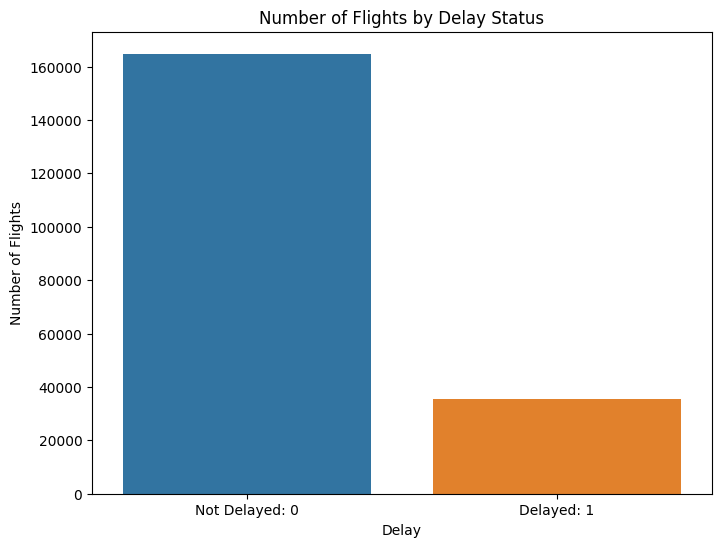

# 항공편 지연 예측기 (Flight Delay Predictor)

    

- 프로젝트 원문(영어) 버전 링크: https://github.com/dchlseo/flight-delay-predictor/blob/main/README.md

- 프로젝트 구글 슬라이드(Google Slide) 링크: https://docs.google.com/presentation/d/1VkzbZx9s_O6xM7_YcQdEBcQiKSCDDxAEzm8sDNFvJso/edit#slide=id.p

## 0. 프로젝트 요약 (Project Summary)
- 미국 국내 항공편 지연 문제로 인한 불편함과 경제적 영향을 완화하기 위한 머신러닝 예측 모델 개발을 목표로 한다. 이를 통해 항공사의 운영 효율성을 향상시키고 승객들의 여행 경험을 개선하는 데 기여할 수 있을 것으로 기대한다.
- 이 프로젝트는 미국 내 항공편 지연을 예측하기 위해 설계된 Streamlit 웹 애플리케이션을 포함하며, XGBoost 모델을 사용한다.
- 애플리케이션은 사용자 친화적이며 온라인에서 접근 가능하며, 데이터 전처리, 탐색적 데이터 분석, 모델링 단계가 별도의 Jupyter 노트북에 문서화되어 있다.
- Streamlit 애플리케이션 프로토타입: https://flight-delay-predictor.streamlit.app/

## 1. 비즈니스 문제/개념설계: 미국 내 국내 항공편 지연 문제 완화

### 배경 및 동기 (Background and Motivation)

**경제적 및 운영 상의 영향**: 항공편 지연은 항공 산업에 있어 운영 효율성과 경제적 비용 측면에서 중대한 도전이다. 지연은 항공사의 일정을 방해하고 운영 비용을 증가시킬 뿐만 아니라 항공사의 부가 서비스에도 영향을 미친다. 지연의 파급 효과는 항공사와 관련 사업체에 상당한 재정적 손실을 초래할 수 있다.

**고객 만족도 및 충성도**: 항공편 지연은 고객의 주요한 서비스 불만의 원인이다. 장시간의 대기, 연결편 놓침, 여행 계획의 혼란은 유저 경험에 상당한 악영향을 미친다. 이러한 불만은 매우 경쟁적인 시장에서 고객의 충성도와 선호도 감소로 이어질 수 있다.

**예측 분석을 통한 문제해결**: 데이터 기반 의사결정이 중요한 시대에, 항공편 지연을 예측하는 모델을 활용하는 것은 필수적이다. 지연을 정확히 예측함으로써 항공사는 일정을 선제적으로 관리하고, 자원을 보다 효율적으로 할당하며, 승객에게 사전에 정보를 제공함으로써 운영 효율성과 고객 만족도를 향상시킬 수 있다.

**전략적 의사결정**: 항공편 지연의 패턴과 원인을 이해하는 것은 항공사와 공항 당국이 전략적 결정을 내리는 데 도움이 될 수 있다. 이에는 항공편 일정 최적화, 회전율 개선, 전반적인 공항 운영 향상 등이 포함된다.

**규제 준수**: 항공사는 종종 정시 운항 성과와 소비자 보고와 관련된 규제 요건을 준수해야 한다. 예측 모델은 더 나은 규제 관리를 지원하고 벌금 등의 리스크를 줄이는 데 도움이 될 수 있다.

**데이터 기반 경쟁 우위**: 경쟁이 치열한 업계에서 항공편 지연을 효과적으로 관리하고 완화할 수 있는 항공사는 상당한 경쟁 우위를 얻을 수 있다. 이 우위는 운영 비용 절감뿐만 아니라 브랜드 명성과 고객 충성도 향상 측면에서도 나타난다.

### 프로젝트 동기 (Project Motivation)

이 프로젝트는 항공 지연으로 나타나는 다면적인 문제를 해결하기 위해 높은 효율성과 정확성을 자랑하는 XGBoost 기계학습 알고리즘을 사용하여 견고한 예측 모델을 개발하는 것을 목표로 한다. 이 모델을 사용자 친화적인 Streamlit 웹 애플리케이션에 통합함으로써, 프로젝트는 항공사, 공항 당국, 심지어 승객들에게도 항공편 지연에 대한 실시간 통찰력과 예측을 제공하는 실용적인 도구를 제공하는 것을 목표로 한다. 이 도구는 운영 효율성과 고객 경험을 향상시킬 뿐만 아니라 항공 산업에서 전략적 계획 및 의사결정을 위한 소중한 자산으로 활용될 수 있다.

## 2. 솔루션 전략

1. **데이터 확보**:
   - 프로젝트는 DACON에서 제공하는 대규모 데이터셋을 활용했다. 이 데이터셋은 미국 내 국내 항공편 역사에 대한 연간 기록 약 100만 행을 포함하고 있으며, 출발 및 도착 정보(주, 공항 코드, 비행 거리, 예상 출발 시간 [EDT], 예상 도착 시간 [EAT])와 항공사 정보(항공사 코드, 항공기 꼬리 번호) 등의 데이터가 포함되어 있다.
   - 데이터 링크: https://dacon.io/competitions/official/236094/overview/description

2. **전처리**:
   - 데이터셋에는 EDT, EAT, 출발 주, 도착 주, 항공사, 운송업체 ID 등의 섹션에서 상당한 양의 누락된 데이터가 있었다.
   - 누락된 EDT 및 EAT의 경우, 출발 공항에서 도착 공항까지의 평균 비행 시간을 계산하여 누락된 값을 추론하는 데 사용했다.
   - 누락된 출발 주 및 도착 주 값은 주:공항 딕셔너리를 생성하여 채웠다.
   - 항공사 값과 운송업체 ID는 항공사:id 딕셔너리를 사용하여 상호 참조(cross-reference)했다.
   - 데이터셋에는 불균형한 레이블(0: 지연 없음, 1: 지연)이 있어, 레이블 분포를 균형있게 하기 위해 과소표집법을 수행했다.

3. **탐색적 데이터 분석 (Exploratory Data Analysis)**:
   - 이 단계에서는 높은 항공편 빈도수나 지연 비율을 가진 시기를 식별하고 시간 기반 패턴을 조사하는 등의 트렌드를 시각화하는 작업을 포함했다.
   - 항공사와 주별로 어떤 곳이 더 높은 항공편 지연 비율을 가지고 있는지 분석했다.

4. **특성 공학 (Feature Engineering)**:
   - EDA에서 얻은 통찰력을 바탕으로, 원자료에서 시간대, 계절, 주 지역과 같은 새로운 특성을 생성하여 모델의 예측력을 강화했다.

5. **머신러닝을 위한 데이터 준비**:
   - 수치 값은 정규화되었고, 범주형 변수는 레이블 인코딩(label encoding)되어 머신 러닝 모델링을 위한 데이터셋을 준비했다.

6. **머신러닝 모델링**:
   - 사용된 모델에는 랜덤 포레스트(Random Forest), XGBoost, LightGBM이 포함되었다.
   - XGBoost와 LightGBM은 테스트된 모델 중 가장 좋은 성능을 보였다.

7. **하이퍼파라미터 튜닝 (Hyperparameter Tuning)**:
   - 이 단계에서는 기본 모델을 세밀하게 조정하여 성능과 정확도를 향상시켰다.

8. **모델 선택**:
   - 애플리케이션에 가장 적합한 모델로 XGBoost가 선택되었으며, 약 60-65%의 정확도를 달성했다.

9. **모델 프로토타입 배포**:
   - Streamlit을 사용하여 XGBoost 모델을 배포하여 비행 지연의 실시간 예측을 위해 사용하였다.
   - 모델의 효과를 테스트하기 위해 모델의 훈련 및 검증에 사용되지 않은 신규 데이터를 사용하였다.
   - 거짓 긍정(1종 오류; false-positive)의 비율을 줄이고 모델의 정밀도를 향상시키기 위해 결정 임계값을 보수적으로 조정하여 모델의 특이성(specificity)을 높였다.

이러한 단계를 통해, 이 프로젝트는 항공편 지연을 예측하는 신뢰할 수 있고 사용자 친화적인 도구를 만들어 항공 산업의 중요한 비즈니스 도전과제를 해결하고자 했다. 철저한 데이터 전처리, 통찰력 있는 탐색적 분석, 전략적 특성 공학, 그리고 신중한 모델 선택 및 튜닝의 조합으로 실제 상황에서 응용가능한 실용적인 해결책이 될 수 있을 것을 기대한다.

이러한 단계를 통해, 프로젝트는 항공편 지연을 예측하는 신뢰할 수 있고 사용자 친화적인 도구를 만들어 항공 산업의 중요한 비즈니스 도전과제를 해결하고자 했다. 철저한 데이터 전처리, 통찰력 있는 탐색적 분석, 전략적 특성 공학, 그리고 신중한 모델 선택 및 튜닝의 조합은 실제 응용을 위한 실용적인 해결책으로 귀결되었다.

## 3. 데이터 분석 인사이트
- **데이터에 상당한 불균형이 존재한다.**
    - 데이터 내 '지연된 항공편' (delayed)의 수가 적어 모델에 부정적인 영향을 미칠 수 있다. 균형 잡힌 샘플링 방법이 필요하다.
  

    

     

- **항공사별 지연율의 유의미한 차이가 존재한다.**
    - 상위 6개 항공사(Southwest, Delta, Skywest, United, American, JetBlue) 중 **JetBlue Airways (24.7%)**가 가장 높은 지연율을 보인다.
      

    

    

- **'큰 주'(big state) 에서 더 많은 지연이 발생한다.**
    - 이들은 대개 항공 트래픽이 가장 많은 주들이다.
      

    

    

- **여름과 겨울 시즌에 지연이 더 많다.**
    - 데이터에 명시적인 날씨 조건이 포함되어 있지 않지만, 계절적 영향(예: 날씨, 휴가철 등)이 존재할 가능성이 있다.
        

    

    

- **대부분의 지연은 저녁부터 이른 아침 시간대(18 - 06)에 발생한다.**

    

   

## 4. 모델 배포 (Streamlit)

### 개요 (Overview):
- 프로젝트는 XGBoost 모델을 사용하여 항공편 지연을 예측한다.
- 기본 설정된 항공사는 'JetBlues'로, 연간 지연율이 거의 20%에 달하는 항공사다.
- 사용자가 출발 주, 도착 주, 출발 시간에 대한 정보를 제공하면, 모델은 항공편의 출발 지연 확률을 제공한다.
- 사용자 입력에 따라 앱은 ML 모델을 실행하는 데 필요한 열을 자동으로 생성한다.
    - 주 정보는 공항 코드로부터 추론된다.
    - 여행 기간은 예상 출발 시간과 도착 시간으로부터 추론된다.
    - 비행 번호(비행기 꼬리 번호)는 무작위로 생성된다.

### 사용 예시 (Usage Example):

### 사용 방법 (How to Use):
1. 필요한 패키지 설치: `pip install streamlit xgboost joblib`
2. 애플리케이션 실행: `streamlit run main.py`

## 5. 결론

### 고객 경험 및 비즈니스 운영 향상을 위한 데이터 기반 접근

이 프로젝트는 항공편 지연에 의해 제기되는 비즈니스 도전과제를 데이터 기반 접근을 통해 해결하고자 한다. 특히 XGBoost 알고리즘과 같은 머신러닝을 활용하여, 항공 여행의 불확실성을 관리하기 위한 선제적인 해결책을 제공한다.

### 프로젝트 하이라이트:
- **예측 성능**: 강력한 데이터셋과 고급 분석을 활용하여, 프로젝트는 예측 정확도와 운영 가능성 사이의 균형을 달성하며, 모델은 지연 예측에서 약 60-65%의 정확도를 보여준다.
- **사용자 친화적 인터페이스**: Streamlit 웹 애플리케이션은 사용자가 항공편 지연 가능성을 빠르게 평가할 수 있는 직관적이고 접근하기 쉬운 플랫폼을 제공한다.
- **종합적 데이터 분석**: 광범위한 전처리와 탐색적 데이터 분석을 통해 통찰력 있는 상관관계의 기반한 서비스를 제공한다.

### 잠재적 응용 분야:

#### 승객을 위한 (For Passengers - User End):
1. **여행 전 알림**: 승객들은 항공편이 지연될 가능성이 높은 경우 몇 시간 전에 알림을 받을 수 있어, 여행 계획에 필요한 조정을 할 수 있다.
2. **여행 계획**: 지연의 패턴을 이해함으로써, 승객들은 항공편을 예약할 때 역사적으로 지연율이 낮은 항공사를 선택하거나 지연 빈도가 높은 특정 시기를 피하는 등 정보에 기반한 결정을 내릴 수 있다.

#### 항공사 및 공항을 위한 (For Airlines and Airports - Business End):
1. **운영 효율성**: 항공사는 모델의 통찰력을 활용하여 일정 최적화, 직원 배치, 자원 관리를 개선하여 지연의 경제적 영향을 줄일 수 있다.
2. **전략적 의사결정**: 데이터는 지연 시 고객 서비스 프로토콜 개선이나 지연 발생률이 높은 공항의 인프라 투자와 같은 장기 전략을 수립하는 데 도움이 될 수 있다.
3. **고객 서비스 향상**: 지연을 예측함으로써 항공사는 승객과 선제적으로 소통하여 전반적인 고객 경험을 개선하고 브랜드 충성도를 높일 수 있다.

#### 비즈니스 시사점:
- **규제 준수**: 개선된 지연 예측은 항공사가 규제 기준을 준수하고 벌금을 피하는 데 도움이 될 수 있다.
- **시장 경쟁력**: 지연을 효과적으로 관리하는 항공사는 시장에서 차별화되어, 정시성과 신뢰성을 중시하는 고객을 유치할 수 있다.

### 결론 (Conclusion)

결론적으로, 항공편 지연 예측기는 단순히 지연을 예측하는 도구 이상이다; 이는 고객 및 비즈니스 관점에서 항공편 지연의 다면적인 도전과제를 해결하는 종합적인 솔루션이다. 이 프로그램의 효과는 즉각적인 운영 대응을 넘어 전략적 계획 및 시장 포지셔닝까지 확장될 수 있다. 항공 산업이 계속 발전함에 따라, 이러한 데이터 기반 도구는 항공 여행의 효율성, 신뢰성 및 전반적인 경험을 향상시키는 데 점점 더 중요해질 것이다.

----- 

### 레파지토리 내용:
1. **데이터 전처리 (Data Preprocessing)**: 데이터 전처리 과정은 `0_preprocessing.ipynb` 파일에서 확인할 수 있다.
    - 원본 데이터 출처: 월간 DACON 항공편 지연 예측 AI 경진대회
    - 원활한 EDA를 위한 초기 전처리 단계
    - `distance_dict.pkl` 및 `time_dict.pkl`: 전처리에 사용된 추가 데이터 및 유틸리티
  
2. **탐색적 데이터 분석 (Exploratory Data Analysis - EDA)**: 탐색적 데이터 분석 과정은 `1_EDA.ipynb`에서 확인할 수 있다.
    - 레이블 불균형 분석
    - 항공사별 지연 비율 분석
      
3. **모델링 (Modeling)**: 모델링 과정은 `2_model.ipynb`에서 살펴볼 수 있다.
    - 사용된 모델: XGBoost
    - 범주형 변수의 레이블 인코딩을 활용한 모델 학습
    - `label_classes.pickle`: 레이블 클래스 정보가 포함된 파일
      
4. **예측 애플리케이션 (Prediction Application)**: 항공편 지연 예측 애플리케이션은 `main.py`를 통해 실행할 수 있다.
    - 사용된 플랫폼: Streamlit
    - 공항 코드와 전체 이름에 대한 매핑 정보 포함
