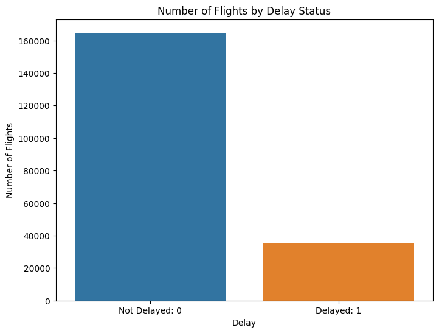
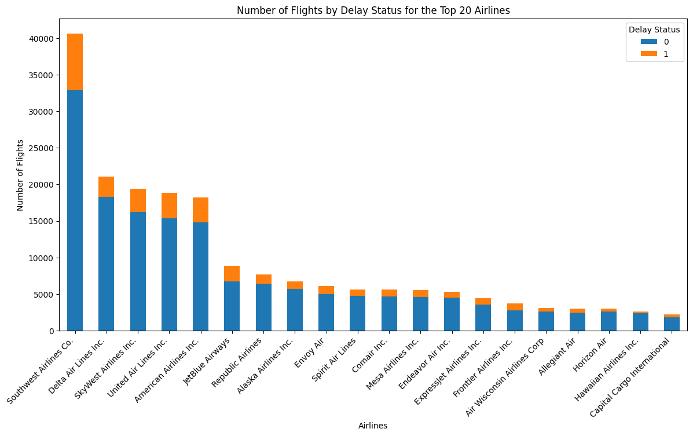
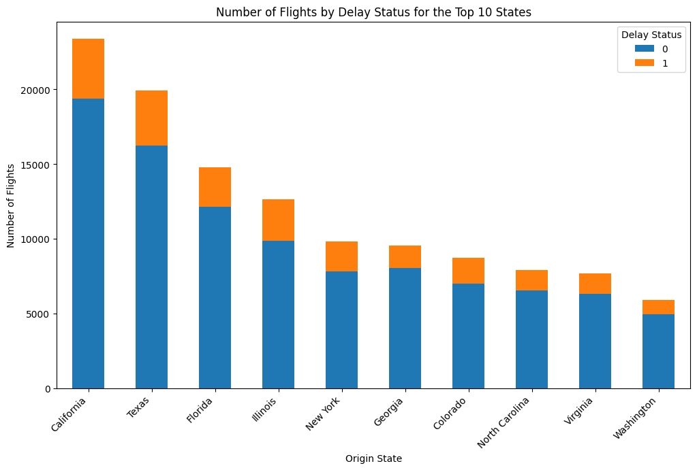
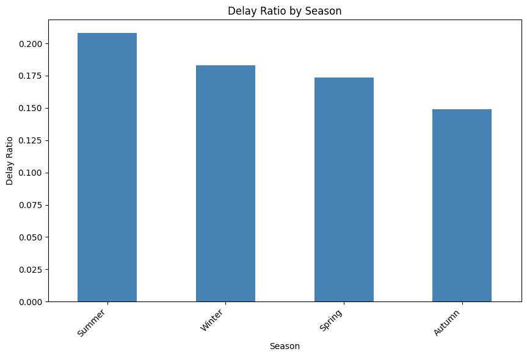
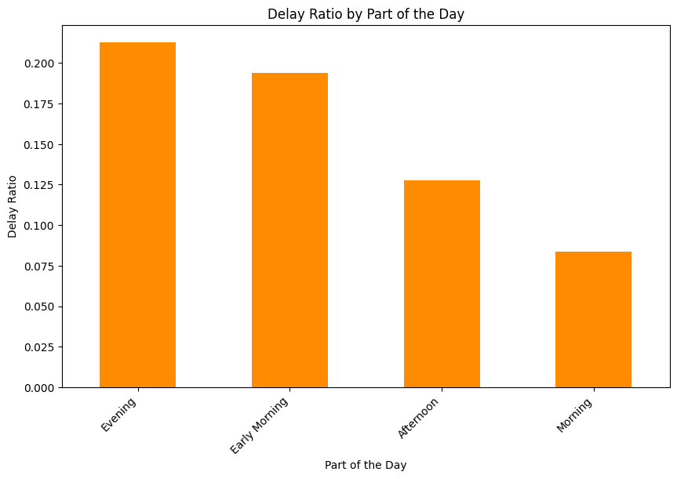

# Flight Delay Predictor

    

- For the Korean version of the project summary, see here: https://github.com/dchlseo/flight-delay-predictor/blob/main/README(kor).md 

- For a Google Slide version of the project summary (in Korean), see here:  https://docs.google.com/presentation/d/1VkzbZx9s_O6xM7_YcQdEBcQiKSCDDxAEzm8sDNFvJso/edit#slide=id.p

## 0. Project Summary
- Addressing the persistent issue of domestic flight delays in the United States, this project aims to mitigate the inconvenience and economic impact caused by these delays through a predictive model, enhancing operational efficiency for airlines and improving travel experiences for passengers.
- This project involves a Streamlit web application designed for predicting flight delays in the United States, utilizing an XGBoost model for accurate predictions.
- The application is user-friendly and accessible online, with comprehensive data preprocessing, exploratory data analysis, and modeling steps documented in separate Jupyter notebooks, ensuring transparency and ease of understanding for users and developers.
- Application prototype created using Streamlit: https://flight-delay-predictor.streamlit.app/

## 1. Business Problem: Mitigating the Impact of Domestic Flight Delays in the US

### Background and Motivation

**Economic and Operational Impact**: Flight delays in the United States represent a significant challenge for the aviation industry, both in terms of operational efficiency and economic cost. Delays not only disrupt airline schedules, leading to increased operational costs, but also affect ancillary services in the aviation ecosystem. The ripple effect of delays can lead to substantial financial losses for airlines and associated businesses.

**Customer Satisfaction and Loyalty**: From a customer perspective, flight delays are a major source of dissatisfaction. Prolonged wait times, missed connections, and disrupted travel plans can significantly impact passenger experience. This dissatisfaction can lead to a decline in customer loyalty and preference, which is crucial in a highly competitive market.

**Predictive Analytics as a Solution**: In an era where data-driven decision-making is paramount, leveraging predictive analytics to forecast flight delays can be a game-changer. By accurately predicting delays, airlines can proactively manage their schedules, allocate resources more efficiently, and inform passengers in advance, leading to improved operational efficiency and customer satisfaction.

**Strategic Decision-Making**: Understanding the patterns and causes of flight delays can aid airlines and airport authorities in making strategic decisions. This includes optimizing flight schedules, improving turnaround times, and enhancing overall airport operations. 

**Regulatory Compliance and Reporting**: Airlines are often subject to regulatory requirements regarding on-time performance and consumer reporting. Predictive models can assist in better compliance management, reducing the risk of penalties and negative publicity.

**Competitive Advantage**: In a competitive industry, airlines that can effectively manage and mitigate flight delays can gain a significant competitive advantage. This advantage is not just in terms of operational cost savings but also in enhancing brand reputation and customer loyalty.

### Project Motivation

The motivation behind this project is to address these multifaceted challenges by developing a robust predictive model using XGBoost, a machine learning algorithm known for its efficiency and accuracy. By integrating this model into a user-friendly Streamlit web application, the project aims to provide a practical tool for airlines, airport authorities, and even passengers, offering real-time insights and predictions about flight delays. This tool is not only a step towards enhancing operational efficiency and customer experience but also serves as a valuable asset for strategic planning and decision-making in the aviation industry.

## 2. Solution Strategy

1. **Data Acquisition**:
   - The project utilized a comprehensive dataset from DACON, a South Korean equivalent of Kaggle. This dataset comprised an annual record of approximately 1 million rows, detailing domestic flight history in the US. It included departure and arrival information (states, airport codes, flight distance, Estimated Departure Time [EDT], Estimated Arrival Time [EAT]), along with airline details (airline code, airplane tail number).
   - data link: https://dacon.io/competitions/official/236094/overview/description

2. **Preprocessing**:
   - The dataset had significant missing data in sections like EDT, EAT, origin_state, destination_state, airline, and carrier_id.
   - For missing EDT and EAT, average flight durations from departure to arrival airports were calculated and used to infer missing values.
   - Missing origin_state and destination_state values were filled using a state:airport dictionary.
   - Airline values and carrier IDs were cross-referenced using an airline:id dictionary.
   - The dataset had imbalanced labels (0: non-delay, 1: delay), so undersampling was performed to balance the label distribution.

3. **Exploratory Data Analysis**:
   - This phase involved visualizing trends, such as identifying months with higher flight frequencies or delay ratios, and examining time-based patterns.
   - Analysis of airlines and states was conducted to determine which had higher flight delay ratios.

4. **Feature Engineering**:
   - Based on insights from the EDA, new features like time_of_day, season, and state_region were created from the raw data to enhance the model's predictive power.

5. **Data Preparation for Machine Learning**:
   - Numeric values were normalized, and categorical variables were label-encoded to prepare the dataset for machine learning modeling.

6. **Machine Learning Modeling**:
   - Models used included Random Forest, XGBoost, and LightGBM.
   - XGBoost and LightGBM showed the best performance among the models tested.

7. **Hyperparameter Tuning**:
   - This step involved refining the base models to enhance their performance and accuracy.

8. **Model Selection**:
   - XGBoost was selected as the best model for the application, achieving an accuracy of approximately 60-65%.

9. **Model Deployment (Prototype)**:
   - The XGBoost model was deployed using Streamlit for real-time prediction on new data.
   - New, unseen data was used to test the model's efficacy.
   - To reduce the rate of false positives and enhance the model's precision, the decision threshold was adjusted to be more conservative, increasing the specificity of the model. 

Through these steps, the project aimed to create a reliable and user-friendly tool for predicting flight delays, thereby addressing a significant business challenge in the aviation industry. The combination of thorough data preprocessing, insightful exploratory analysis, strategic feature engineering, and careful model selection and tuning culminated in a practical solution for real-world application.

## 3. Data Analysis Insights
- **There is significant imbalance in the data.**
    - The smaller number of 'delayed flights' in our data could negatively impact the model. Requires a balanced sampling method.
  

    

     

-  **Delay rates significantly differ among airlines.**
    - Among the Top 6 (Southwest, Delta, Skywest, United, American, JetBlue), **JetBlue Airways (24.7%)** has the greatest delay rate.
      

    

    

- **"Big states" have greater delays.**
    - These are most often states with biggest air traffic.
      
 

    

    

- **Summer and winter seasons have more delays.**
    - While our data does not contain explicit weather conditions, it is possible that seasonal effects are present (i.e., weather, holidays, etc.)
        

    

    

- **Most delays take place during evening-early morning flights (18 - 06).**

    

   

## 4. Model Deployment (Streamlit)

### Overview:
- The project utilizes an XGBoost model to predict flight delays.
- The default airline is set to 'JetBlues', which shows up to nearly 20% delay rate annually. 
- When the user provides information about the departure state, arrival state, and departure time, the model provides the probability of the flight's departure delay.
- Based on user input, the app automatically generates columns required for running the ML model.
    - State info is inferred from the airport code.
    - Travel duration is inferred from estimated departure time and arrival time.
    - Flight number (airplane tail number) is randomly generated. 

### Usage Example:

### How to Use:
1. Install the necessary packages: `pip install streamlit xgboost joblib`
2. Run the application: `streamlit run main.py`

## 5. Conclusions

### Data-Driven Approach to Enhancing Customer Experience and Business Operations

This project represents a significant step forward in addressing the challenges posed by flight delays through a data-driven approach. By harnessing the power of machine learning, specifically the XGBoost algorithm, the Flight Delay Predictor offers a proactive solution for managing the uncertainties of air travel. 

### Key Project Highlights:
- **Predictive Accuracy**: Utilizing a robust dataset and advanced analytics, the project achieves a balance between predictive accuracy and operational feasibility, with the model demonstrating around 60-65% accuracy in delay prediction.
- **User-Friendly Interface**: The Streamlit web application provides an intuitive and accessible platform for users to quickly assess the likelihood of flight delays.
- **Comprehensive Data Analysis**: Extensive preprocessing and exploratory data analysis ensure that the model is built on a foundation of thorough understanding and insightful correlations.

### Potential Applications:

#### For Passengers (User End):
1. **Pre-Travel Notifications**: Passengers can be alerted hours in advance if their flight is likely to be delayed, allowing them to make necessary adjustments to their travel plans.
2. **Travel Planning**: By understanding patterns of delays, passengers can make informed decisions when booking flights, such as choosing airlines with lower historical delay rates or avoiding certain times of the year with higher delay frequencies.

#### For Airlines and Airports (Business End):
1. **Operational Efficiency**: Airlines can use the model's insights to optimize scheduling, staff allocation, and resource management, reducing the economic impact of delays.
2. **Strategic Decision Making**: The data can inform long-term strategies, such as improving customer service protocols during delays or investing in infrastructure at airports with higher delay incidences.
3. **Enhanced Customer Service**: By anticipating delays, airlines can proactively communicate with passengers, improving the overall customer experience and potentially enhancing brand loyalty.

#### Broader Implications:
- **Regulatory Compliance**: Improved delay predictions can assist airlines in adhering to regulatory standards and avoiding penalties.
- **Market Competitiveness**: Airlines that effectively manage delays can differentiate themselves in a competitive market, attracting customers who value punctuality and reliability.

### Conclusion

In conclusion, the Flight Delay Predictor is more than just a tool for predicting delays; it's a comprehensive solution that addresses the multifaceted challenges of flight delays from both a customer and business perspective. Its applications extend beyond immediate operational responses to strategic planning and market positioning. As the aviation industry continues to evolve, such data-driven tools will become increasingly vital in enhancing the efficiency, reliability, and overall experience of air travel.

----- 

### Repository Contents:
1. **Data Preprocessing**: The data preprocessing process can be found in the `0_preprocessing.ipynb` file.
    - Original data source: Monthly DACON Flight Delay Prediction AI Contest
    - Includes initial preprocessing steps for smooth EDA
    - `distance_dict.pkl` and `time_dict.pkl`: Additional data and utilities used in preprocessing
  
2. **Exploratory Data Analysis (EDA)**: The exploratory data analysis process is available in `1_EDA.ipynb`.
    - Analysis of label imbalance
    - Analysis of delay ratios by airline
      
3. **Modeling**: The modeling process can be examined in `2_model.ipynb`.
    - Model used: XGBoost
    - Utilized label encoding for categorical variables in model training
    - `label_classes.pickle`: File containing label class information
      
4. **Prediction Application**: The flight delay prediction application can be executed through `main.py`.
    - Platform used: Streamlit
    - Includes mapping information for airport codes and their full names
